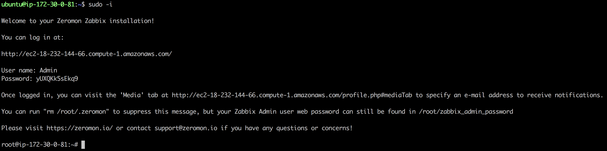

# Zeromon

[Zeromon](https://zeromon.io/) provides a pre-built [Zabbix](https://www.zabbix.com/) installation via:

- [Amazon Web Services AMI](https://aws.amazon.com/marketplace/pp/B07MD6N9ZQ/?_ptnr_doc_github_repo_readme) (Amazon Machine Image)
- [DigitalOcean Marketplace One-Click](https://marketplace.digitalocean.com/apps/zeromon-zabbix)
- Linode One-Click App _(coming soon!)_

## Usage

After deployment of our image, the automation from this repository will run and take approximately 2-3 minutes.
You can verify that the process is complete by simply visiting the IP address or DNS name of your new instance in a web browser.
You should see the Zabbix log-in screen asking for a user name and password once it is ready.

To log in to your Zabbix web interface, you will need the "Admin" password for the web interface.
You must log in to your server via SSH to get this password.

Once logged in as the `root` user via SSH, you should see instructions that include the user name (`Admin`) and randomly generated password, which you will use to log in to your Zabbix web interface; similar to the following screenshot:



### AWS/EC2

When using AWS, you will need to SSH to your EC2 instance as the `ubuntu` user with the SSH key that you used when deploying via AWS.
Once logged in via SSH as the `ubuntu` user, you will want to run `sudo -i` to switch to the `root` user account.

### DigitalOcean / Linode

With both DigitalOcean and Linode, you should be able to SSH to your Droplet or Linode as the `root` user directly using a password or SSH key, depending upon whether you selected a public key when deploying.

## HTTPS/SSL _(optional)_

If you would like to enable HTTPS with a valid SSL certificate for your Zabbix web interface, you are free to do so!
The Zeromon images come pre-installed with `certbot` to generate a free SSL certificate using [Let's Encrypt](https://letsencrypt.org/).
You can point the (sub-)domain name which you intend to use for Zabbix to the IP address of your server.
You can then run the following command via SSH with your own domain name and follow the prompts:

```
certbot -d example.com
```

Certbot will automatically renew your SSL certificate regularly to prevent expiry.

## Slack Alerts _(optional)_

Zeromon includes the ability to send Slack alerts/notifications!
This is supported with the free version of Slack.
All that is required is a [Slack.com incoming webhook integration](https://slack.com/apps/A0F7XDUAZ-incoming-webhooks).

You can [find more information about setting up Slack alerts within Zeromon here](SLACK.md).

## Pricing

The cost for usage of the Amazon AMI software is $0.05 USD per hour (or basically, $36.00 USD per month) for all instance types in all regions, in addition to the EC2 pricing itself.
We also offer a 7-day 100% money-back guarantee.

The DigitalOcean Marketplace One-Click installation is currently undergoing testing and is free to deploy for the near future.

The Linode One-Click App is undergoing development and will be free to deploy as well.

### Instance Type

Note that on AWS, $0.05/hour is billed on top of the AWS instance pricing which is calculated separately and dependent upon Amazon based on the region and instance type.
We generally recommend starting with a `t3.medium` instance type, but you may be able to use a `t3.small` for a smaller environment.
However, a `t3.large` (or bigger) may be necessary depending upon the number of instances that you plan to monitor and pollers you configure within the Zabbix server.

You may want to experiment with other EC2 instance types as well to determine what works best for you and your environment - please feel free to let us know!

The DigitalOcean Marketplace One-Click was built with the smallest sized ($5.00/month) Droplet, but you will want to scale up with the number of servers that you intend to monitor from Zabbix.

The Linode One-Click App was built using their 2GB ($10.00/month) plan, but again, scale according to your individual needs.

## Support

Any questions or concerns can be sent to support@zeromon.io and we will do our best to help you out!

Unfortunately, the Amazon Machine Image is not currently available within the Amazon GovCloud region at this time.

## Technical Details

If you are curious about how the Amazon Machine Image or DigitalOcean Marketplace One-Click are created, check out our [build documentation](BUILD.md)!
